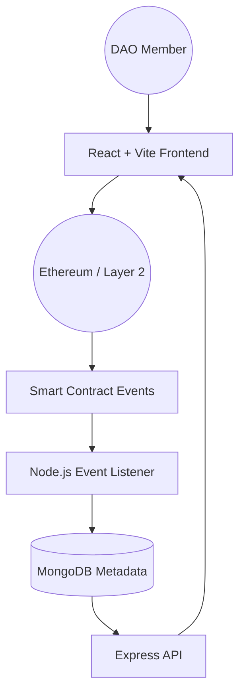

# Omega DAO: Enterprise-Grade Governance Platform


Omega DAO is a next-generation Decentralized Autonomous Organization (DAO) platform designed for institutional-grade governance. It provides a secure, transparent, and aesthetically premium ecosystem for decentralized decision-making, treasury management, and real-time analytics.

## ✨ Key Features

- **🛡️ Advanced Smart Contracts**: Built on OpenZeppelin standards with secure voting, snapshot capabilities, and multi-sig execution.
- **🏛️ Multi-Layer Governance**: Supports tokens-weighted voting, quadratic voting models, and timelocked execution.
- **💎 Enterprise Dashboard**: A high-performance React UI with glassmorphism, 4K responsiveness, and real-time data visualization.
- **📊 Real-time Indexing**: Event-driven backend service synchronizes on-chain activities with a high-speed MongoDB indexing layer.
- **💰 Intelligent Treasury**: Transparent portfolio management for ETH, USDC, and custom ERC-20 tokens.
- **📈 Deep Analytics**: Trend analysis for participation rates, voter distribution, and treasury growth.

## 🏗️ Architecture



## 🛠️ Technology Stack

- **Frontend**: React.js, TypeScript, Tailwind CSS, Framer Motion, Recharts.
- **Web3**: Wagmi, Viem, RainbowKit, Ethers.js.
- **Backend**: Node.js, Express, MongoDB.
- **Smart Contracts**: Solidity, Hardhat, OpenZeppelin.

## 🚀 Quick Start

### Prerequisites
- Node.js v18+
- MongoDB instance
- MetaMask or WalletConnect compatible wallet

### 1. Smart Contract Setup
```bash
cd blockchain
npm install
npx hardhat compile
```

### 2. Backend Configuration
Create a `.env` file in the `/server` directory:
```env
PORT=5000
MONGODB_URI=mongodb://localhost:27017/dao_platform
RPC_URL=your_ethereum_rpc_url
GOVERNOR_ADDRESS=deployed_contract_address
```
Start the server:
```bash
cd server
npm install
node index.js
```

### 3. Frontend Execution
```bash
cd client
npm install
npm run dev
```

## 🛡️ Governance Security

- **Snapshots**: Voting power is determined by token balance at the exact block the proposal is created, preventing "voting buy-ins."
- **Timelock**: A mandatory 48-hour delay between vote passing and execution ensures the community can veto malicious actions.
- **RBAC**: Role-Based Access Control via TimelockController manages ownership and administrative permissions.

## 📄 License
This project is licensed under the MIT License - see the [LICENSE](LICENSE) file for details.

---

*Built with ❤️ by the Omega DAO Core Team.*
